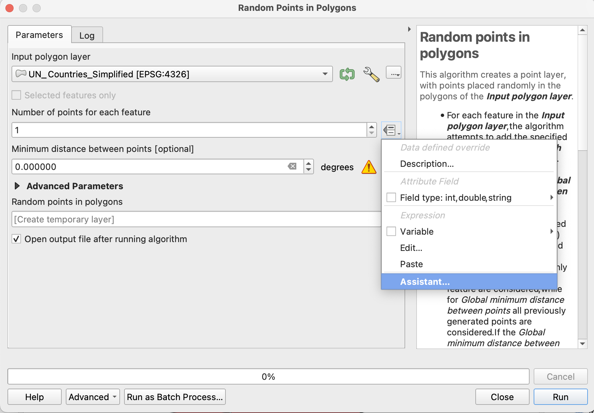

# Dot Density Tutorial: 3 - Create Dot Layer

### Summary
In __Tutorial 3__ you will convert your data into a dot density layer.

### Random Points In Polygons
Open the QGIS toolbox, and search for "Random Points In Polygons". We will use this tool to create our dot density layer. 

Once open, select "UN_Countries_Simplified" as the __input layer__.

Next, we need to specify how many dots are going to be created for each feature using the ST_EMP_TRSMN as a base. For "Number of points for each feature", select __settings__ (), then select "Assistant". 

###### Figure 3.1: Selecting the assitant to specify a data-driven value for "Number of points for each feature".

With the assistant open, we're going to use a formula to calculate how many dots should appear for each feature. Dot density maps commonly aggregate data so as to not include a 1:1 ratio of data values to dots. In our case, we're going to aggregate the data so that 1 dot equals 10,000 people. 

To this, open the __formula wizard__ (())

